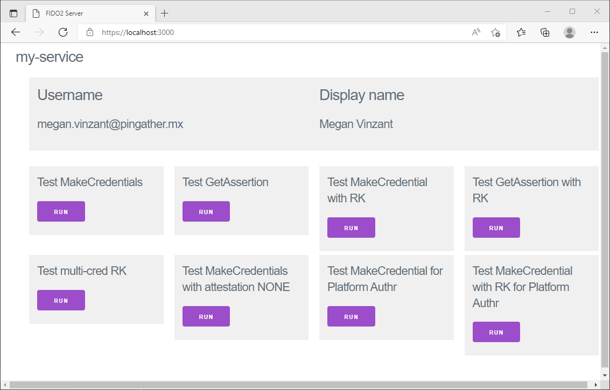

fido2-demoserver
==

FIDO2 Demo Server for Node.js using [@s1r-J/fido2server-lib](https://github.com/s1r-J/fido2server-lib) npm module.

## Install

Assume you have already installed Node.js.

1. Clone this repository.

```
$ git clone https://github.com/s1r-J/fido2-demoserver.git
```

2. To use HTTPS, install [mkcert](https://github.com/FiloSottile/mkcert) and create private key and certificate. If you have HTTPS development environment, it can be used.
    - If you don't have, following this entry: [Why and How to Use HTTPS in Your Local Development Environment](https://auth0.com/blog/using-https-in-your-development-environment/)

3. Store private key PEM(default `localhost-key.pem`) and certificate PEM(default `localhost.pem`) in `ssl` folder.
4. Copy from `.env.sample` file to `.env` file.
5. `npm install`

## Usage

1. `npm start`
2. Wait a moment, access `https://localhost:3000` in web browser.



In this condition, you can also use [self-conformance test tools](https://fidoalliance.org/certification/functional-certification/conformance/).

Note: Windows Hello maybe not works properly using `https://localhost:3000`. Use other actual domain.

### Customize

Environment variable is in `.env` file.

#### Hostname and Port

If you want to change hostname or port, change `HOSTNAME` or `PORT` in `.env` file.
In that state, for passing self-conformance test replace metadata service data file.

To get metadata service data, using `npm run mds`.
For MDS version 2 `fidomds/mds2-<random value>.json` is created
and for MDS version3 `fidomds/mds3-<random value>.json`.

## License

[Apache-2.0](http://www.apache.org/licenses/LICENSE-2.0.html)
